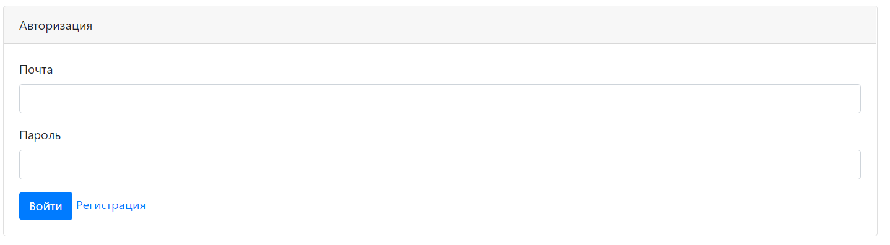
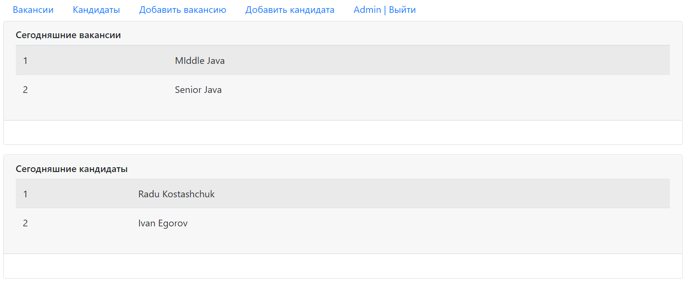
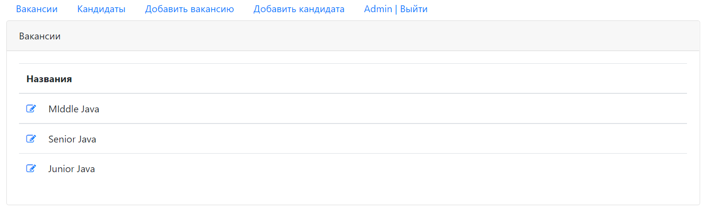
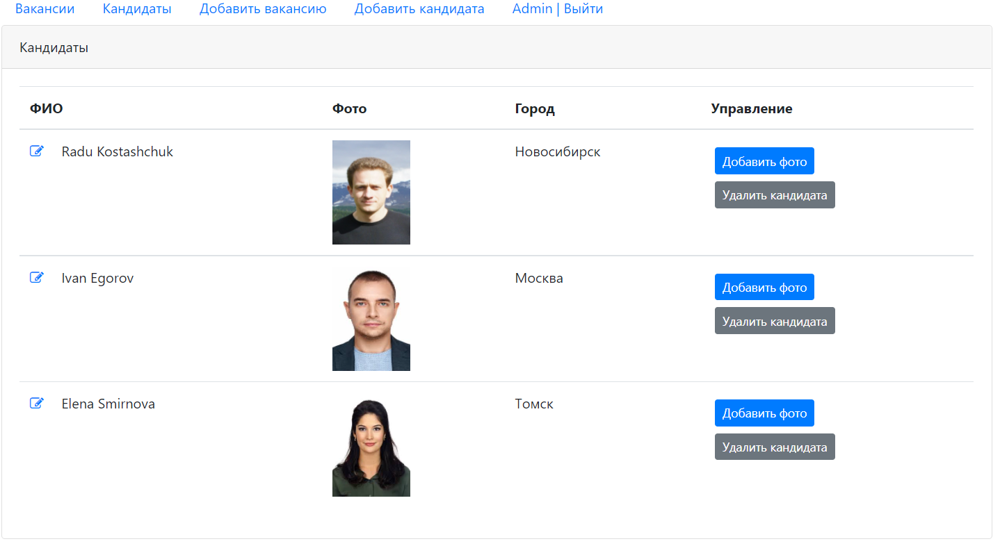
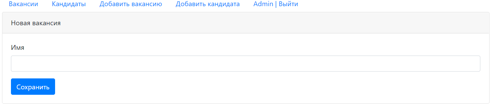
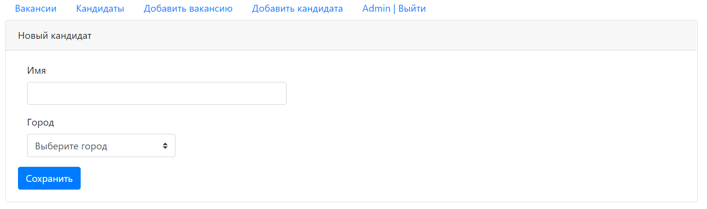

# job4j_dreamjob
## О проекте

Это приложение - база вакансий и кандидатов.

Модератор может добавлять вакансии и кандидатов в приложение.

## Обзор

Страница входа.

Главная страница.

Список вакансий.

Список кандидатов.

Страница добавления вакансий.

Страница добавления кандидатов.

## Настройка и сборка

У приложения есть три файла конфигурации находящихся в папке /src/main/resources/:

1. db.properties - настройки соединения с базой данных.

2. dreamjob.properties - путь к каталогу, куда будут сохраняться фотографии кандидатов.

3. log4j.properties - настройки логгера.

Сборка осуществляется командой: mvn package.

После сборки приложение нужно развернуть в контейнере сервлетов и настроить сервер баз данных.

## Контакты

Email: kostasc@mail.ru
Telegram: @rkostashchuk